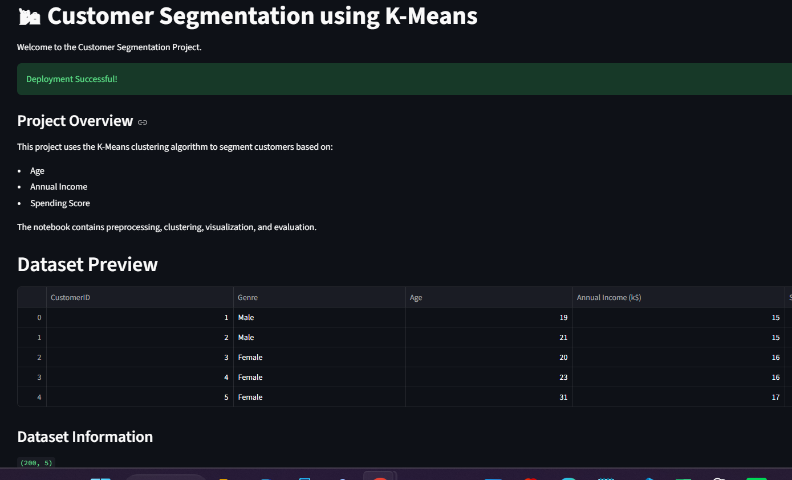
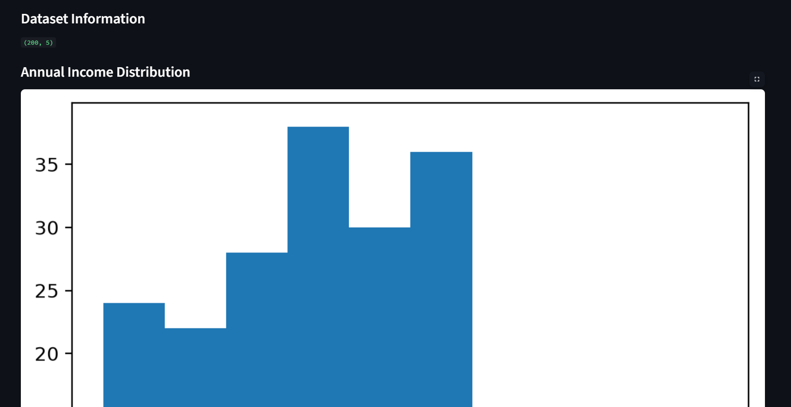
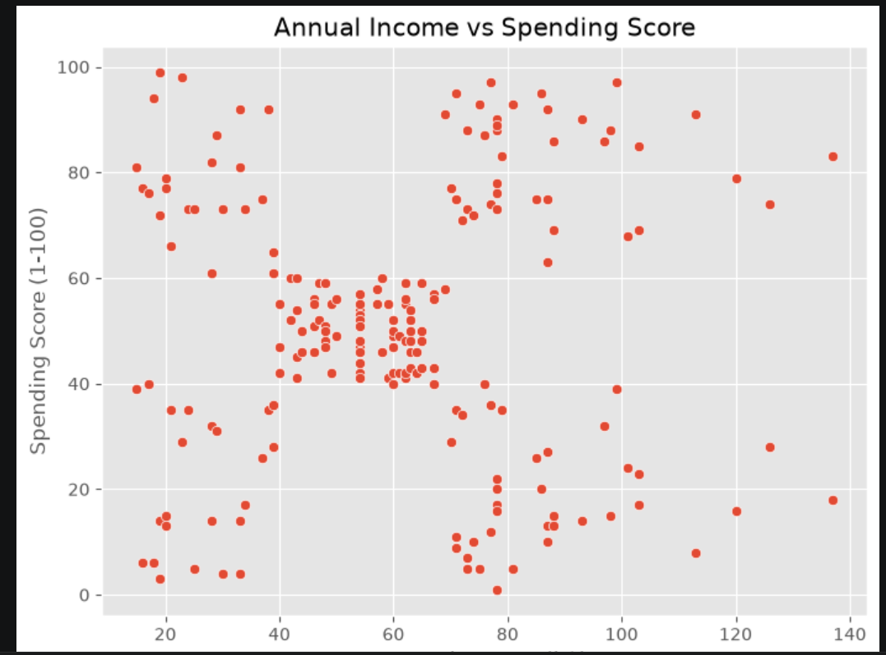
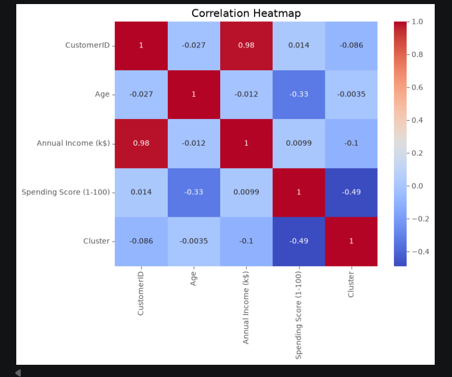
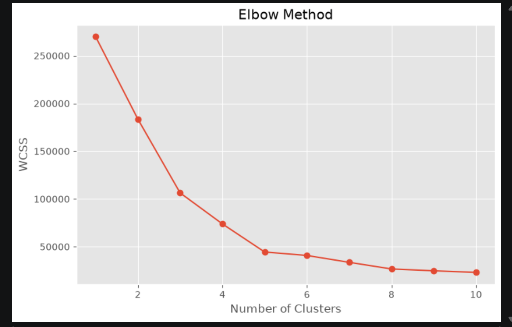
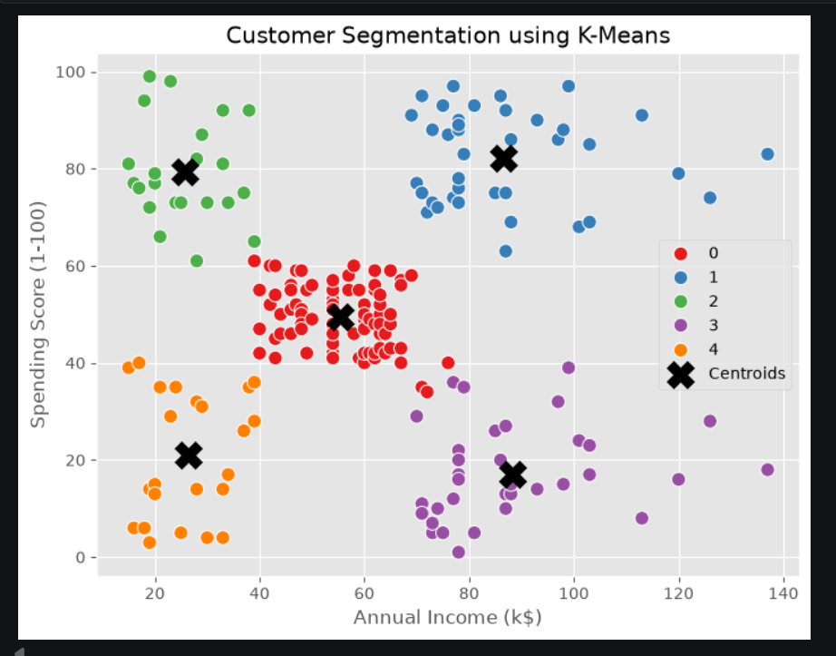

# 📂 Project Architecture

```text
Customer-Segmentation/
│
├── .devcontainer/
├── data/
│   └── Mall_Customers.csv
│
├── notebook/
│   ├── Customer_Segmentation.ipynb
│   └── app.py
│
├── README.md
├── requirements.txt
├── .gitignore
│
├── home.png
├── histogram.png
├── spending.png
├── heatmap.png
├── elbow_method.png
├── customer_segmentation_k_mean.png
```

---

# 🚀 Customer Segmentation using K-Means

A Machine Learning project that uses the **K-Means Clustering Algorithm** to segment customers based on their purchasing behavior using **Age**, **Annual Income**, and **Spending Score**. The project is deployed using **Streamlit** for an interactive web application.

---

## 🌐 Live Demo

🔗 https://customer-segmentation-uycmqcbujyqm4vxjmxkfi2.streamlit.app

---

## ✨ Features

- 📊 Customer Dataset Preview
- 📈 Dataset Information
- 📉 Annual Income Distribution
- 💰 Spending Score Analysis
- 🔥 Correlation Heatmap
- 📍 Elbow Method for Optimal Clusters
- 🎯 K-Means Cluster Visualization
- 🌐 Streamlit Web Application

---

## 🛠️ Technologies Used

- Python
- Streamlit
- Pandas
- NumPy
- Matplotlib
- Seaborn
- Scikit-learn

---

## 📂 Dataset

Mall Customers Dataset

---

## 📸 Project Screenshots

### 🏠 Home Page


### 📊 Annual Income Distribution


### 💰 Spending Score Analysis


### 🔥 Correlation Heatmap


### 📍 Elbow Method


### 🎯 Customer Segmentation


---

## ▶️ Run Locally

```bash
git clone https://github.com/Naina137/Customer-Segmentation.git
cd Customer-Segmentation
pip install -r requirements.txt
streamlit run notebook/app.py
```

---

## 👩‍💻 Connect with the Author

**Naina Gupta**

- 🔗 GitHub: https://github.com/Naina137
- 💼 LinkedIn: https://www.linkedin.com/in/naina-kumari-06373132b

---

⭐ **If you found this project useful, please consider giving it a Star!**
